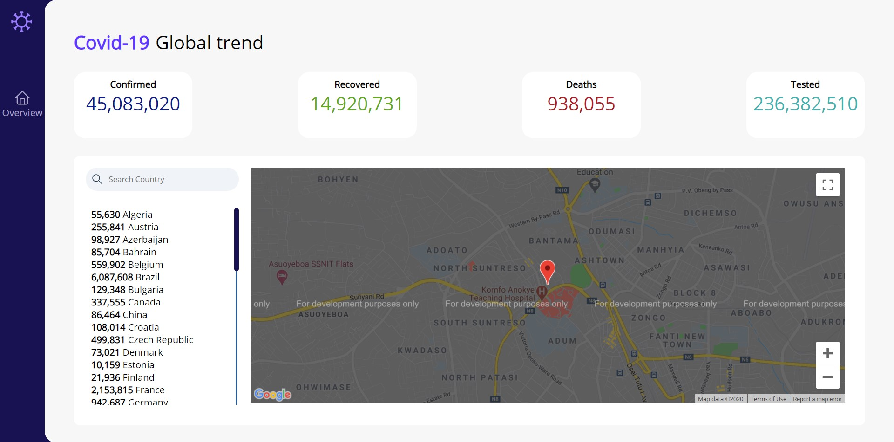

# COVID-19 Tracker

A simple website to show the number of confirmed cases, recovered cases, deaths and tests carried out

## Pages:

- Overview: For a general idea on the status of various countries and the world.
- \*Symptoms: To show various symptoms of COVID-19

## Resources used:

- <a href='https://api.apify.com'>Apify.com's covid api</a>
- Google Maps api

Design inspired by <a href='https://dribbble.com/shots/10796247-Corona-Covid19-Situation-Live-Board'>dribbble sample<a/>

-
